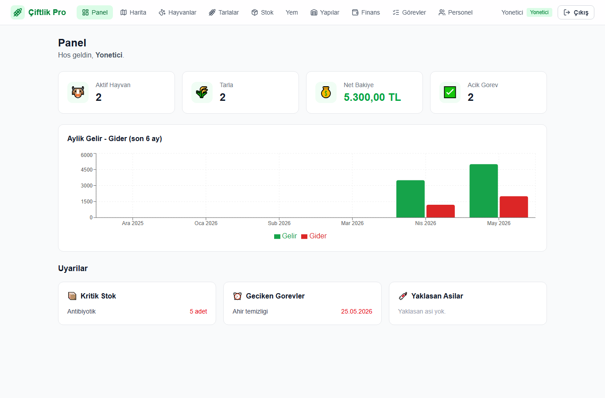
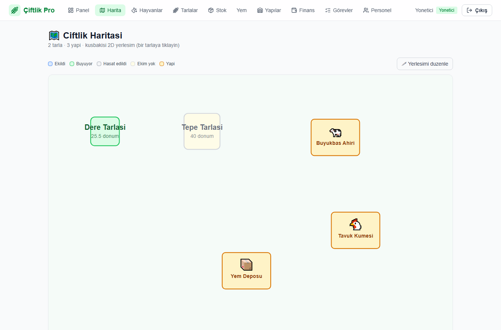
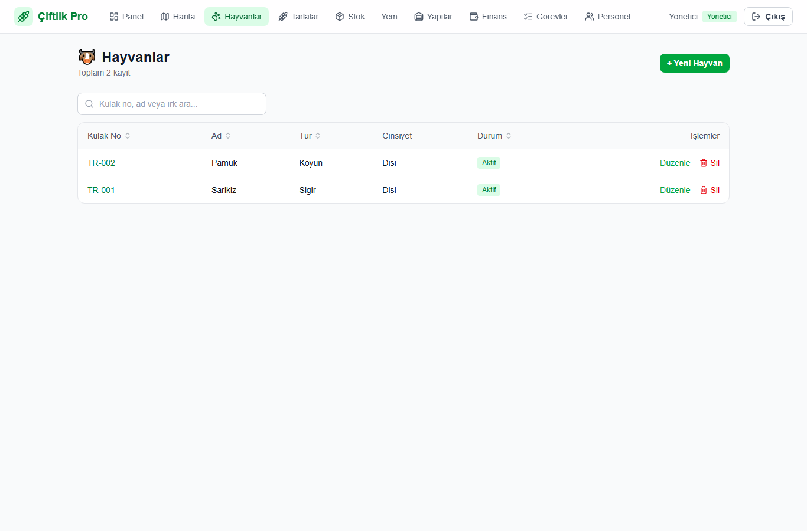
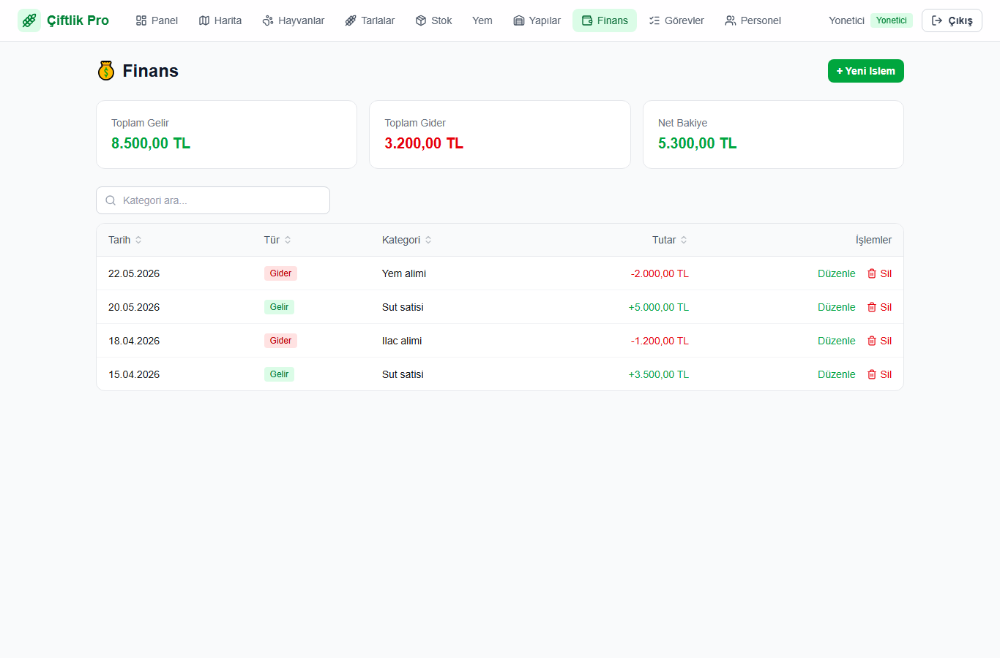
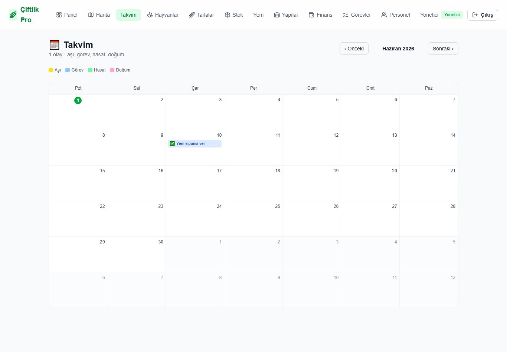
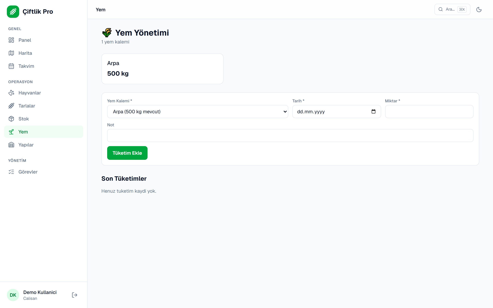
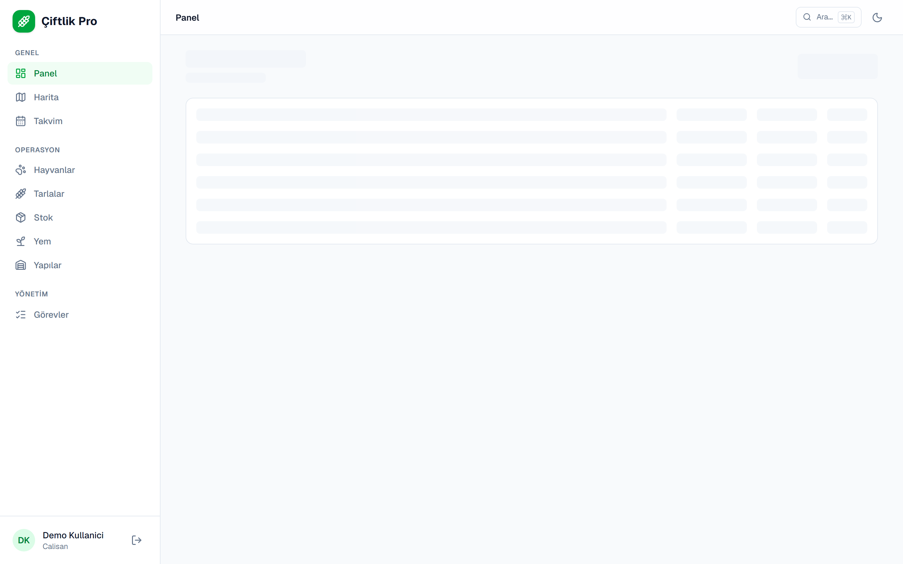
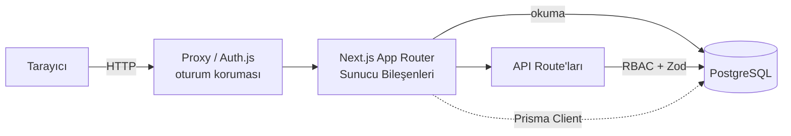

<div align="center">

# 🌾 Çiftlik Pro

**Bir çiftliğin tüm operasyonlarını — hayvan, tarla, stok, finans ve görevler —
rol bazlı yetkilendirmeyle tek panelden yöneten tam yığın Çiftlik Yönetim Sistemi (ERP).**

[](https://github.com/YusufKosarDev/ciftlik-pro/actions/workflows/ci.yml)
[](https://nextjs.org/)
[](https://www.typescriptlang.org/)
[](https://www.prisma.io/)
[](https://www.postgresql.org/)
[-success?logo=vitest&logoColor=white)](#test--kalite)
[](#test--kalite)
[](LICENSE)

🔗 **Canlı Demo: [ciftlik-pro.vercel.app](https://ciftlik-pro.vercel.app)**
&nbsp;·&nbsp; Giriş için **"Demo olarak gez"** butonu (veya `demo@ciftlik.com` / `demo1234`)

</div>

---

## 📸 Ekran Görüntüleri

| Panel (Dashboard) | 2D Çiftlik Haritası |
| ----------------- | ------------------- |
|  |  |

| Hayvanlar (aranabilir tablo) | Finans |
| ---------------------------- | ------ |
|  |  |

| Takvim (aşı/görev/hasat/doğum) | Yem Yönetimi |
| ------------------------------ | ------------ |
|  |  |

**Hayvan detayı** — sağlık, aşı, süt verimi & ağırlık grafikleri, üreme ve soy:



## ✨ Özellikler

- **Kimlik doğrulama & RBAC** — giriş ve rol bazlı erişim (Admin, Çalışan,
  Veteriner, Muhasebeci); yeni personeli yalnızca Admin oluşturur (herkese açık
  kayıt yoktur). Parolalar bcrypt ile hash'lenir.
- **Hayvan takibi** — kayıt yönetimi, sağlık kayıtları, aşı takvimi (tarih
  uyarılı), süt verimi (trend grafiği), ağırlık/büyüme takibi (grafik).
- **Üreme & soy** — gebelik/doğum kayıtları ve yavru–anne (pedigri) bağlantısı.
- **Tarla yönetimi** — tarlalar, ekim/hasat kayıtları, ekim başına maliyet/gelir
  ve dönüm başına verim; 2D çiftlik haritası.
- **Stok & yem** — yem/ilaç/ekipman takibi, kritik seviye uyarısı; yem tüketimi
  stoğu otomatik düşürür (transactional).
- **Finans** — gelir-gider kayıtları, net bakiye özeti, aylık grafik.
- **Takvim** — aşı, görev, hasat ve doğumlar tek aylık takvimde.
- **Personel & görevler** — çalışanlara görev atama, gecikme uyarısı.
- **Dashboard** — özet kartları, kritik stok / geciken görev / yaklaşan aşı uyarıları.
- **Hoş geldin turu (onboarding)** — ilk panel girişinde role özel, çok adımlı
  tanıtım modal'ı; Profil'den istenildiğinde yeniden başlatılabilir.
- **Aranabilir tablolar** — tüm liste modüllerinde arama, kolon sıralama ve sayfalama.
- **E-posta bildirimleri** — günlük cron (Vercel Cron) ile kritik stok, geciken
  görev ve yaklaşan aşı özetini yöneticilere e-posta gönderir (Resend).

## 🏆 Öne Çıkan Mühendislik Detayları

- **Rol bazlı yetkilendirme (RBAC)** tek merkezden (`src/lib/authz.ts`); hem yazma
  (API) hem hassas okuma (sayfa) düzeyinde uygulanır.
- **Uçtan uca tip güvenliği** — Zod şemaları hem istemci hem sunucuda doğrular;
  Prisma ile veritabanı tipleri.
- **Test & CI/CD** — 156 birim/bileşen testi (Vitest + Testing Library) + 6 uçtan uca test (Playwright),
  GitHub Actions'ta gerçek PostgreSQL servisiyle her PR'da çalışır.
- **Serverless-doğru veritabanı** — pooled (`DATABASE_URL`) + direct
  (`DIRECT_URL`) ayrımıyla Vercel + Neon/Supabase'e hazır.
- **Yeniden kullanılabilir tasarım sistemi** — `cva` tabanlı Button/Badge
  primitive'leri ve jenerik `DataTable` bileşeni.

## 🧱 Mimari



- **App Router (RSC)** — listeler doğrudan sunucuda Prisma ile okunur.
- **API Route'ları** — tüm yazma işlemleri; `authorizeWrite` (RBAC) + Zod doğrulaması.
- **Auth.js (NextAuth v5)** — JWT oturum; edge-uyumlu proxy ile rota koruması.
- **Prisma** — tek `PrismaClient` örneği (singleton).

## 🔐 Güvenlik & RBAC

Yetkilendirme tek merkezden yönetilir (`src/lib/authz.ts`) ve **iki katmanda**
uygulanır: yazma uçları `authorizeWrite` ile, hassas/forma dayalı sayfalar ise
`requirePageWrite` / `requirePageView` ile korunur. **Okuma** giriş yapmış her
kullanıcıya açıktır; **yazma** ise role göre kısıtlanır:

| Rol           | Yazma yetkisi                                                        |
| ------------- | ------------------------------------------------------------------- |
| **Admin**     | Tüm modüller + personel yönetimi + denetim günlüğü                  |
| **Çalışan**   | Hayvan, süt, ağırlık, tarla/ekim, stok/yem, yapılar, üreme         |
| **Veteriner** | Sağlık & aşı, üreme, ağırlık                                        |
| **Muhasebeci**| Finans (gelir-gider)                                                |

Sertleştirme önlemleri:

- **Herkese açık kayıt yoktur** — yeni personeli yalnızca Admin oluşturur
  (`/api/auth/register`); ziyaretçiler salt-okunur **"Demo olarak gez"** ile gezer.
- **Demo hesabı salt-okunurdur** — hiçbir yazma işlemi yapamaz (canlı demoda veri korunur).
- **Parolalar bcrypt** ile hash'lenir; düz metin asla saklanmaz/dönülmez.
- **Çift taraflı doğrulama** — Zod şemaları hem istemcide hem her yazma ucunda sunucuda çalışır.
- **Denetim günlüğü** — her yazma işlemi (kim / ne / ne zaman) `AuditLog`'a kaydedilir.
- **Korumalı cron** — bildirim ucu `CRON_SECRET` ile `Authorization` başlığı doğrular.

## 🛠️ Teknolojiler

- [Next.js 16](https://nextjs.org/) (App Router) + TypeScript
- [PostgreSQL](https://www.postgresql.org/) + [Prisma 6](https://www.prisma.io/) (ORM)
- [Auth.js (NextAuth v5)](https://authjs.dev/) — kimlik doğrulama
- [Tailwind CSS](https://tailwindcss.com/) — arayüz
- [Zod](https://zod.dev/) — veri doğrulama
- [Recharts](https://recharts.org/) — grafikler
- [Vitest](https://vitest.dev/) + [Playwright](https://playwright.dev/) — test
- [Docker](https://www.docker.com/) — yerel veritabanı

## Kurulum

### Gereksinimler

- Node.js 20+
- Docker (PostgreSQL için)

### Adımlar

1. Bağımlılıkları yükleyin:

   ```bash
   npm install
   ```

2. Ortam değişkenlerini ayarlayın — `.env.example` dosyasını `.env` olarak
   kopyalayıp değerleri doldurun:

   ```bash
   cp .env.example .env
   ```

   `AUTH_SECRET` üretmek için:

   ```bash
   node -e "console.log(require('crypto').randomBytes(32).toString('base64'))"
   ```

3. PostgreSQL veritabanını Docker ile başlatın:

   ```bash
   docker compose up -d
   ```

4. Veritabanı şemasını uygulayın:

   ```bash
   npx prisma migrate dev
   ```

5. (İsteğe bağlı) Örnek verilerle doldurun:

   ```bash
   npm run db:seed
   ```

6. Geliştirme sunucusunu başlatın:

   ```bash
   npm run dev
   ```

   Uygulama [http://localhost:3000](http://localhost:3000) adresinde çalışır.

### Örnek giriş bilgileri

Seed çalıştırıldıysa:

| E-posta             | Parola     | Rol       |
| ------------------- | ---------- | --------- |
| admin@ciftlik.com   | sifre1234  | Admin     |
| ahmet@ciftlik.com   | sifre1234  | Çalışan   |
| vet@ciftlik.com     | sifre1234  | Veteriner |

## Komutlar

| Komut              | Açıklama                          |
| ------------------ | --------------------------------- |
| `npm run dev`      | Geliştirme sunucusu               |
| `npm run build`    | Üretim derlemesi                  |
| `npm run start`    | Üretim sunucusu                   |
| `npm run lint`     | Kod denetimi (ESLint)             |
| `npm test`         | Birim testleri (Vitest)           |
| `npm run test:e2e` | Uçtan uca testler (Playwright)    |
| `npm run db:seed`  | Veritabanını örnek veriyle doldur |

## Test & Kalite

- **Birim testleri (Vitest):** doğrulama şemaları, RBAC yetkilendirme,
  finans/harita/tarih/takvim yardımcıları + UI bileşenleri (Testing Library:
  Badge/Button/EmptyState/DataTable/OnboardingModal) — `npm test` (156 test). Kapsam raporu için
  `npm run test:coverage` (iş mantığı `src/lib` için ~%95 satır kapsamı).
- **Uçtan uca testler (Playwright):** kimlik doğrulama, hayvan CRUD akışı ve
  RBAC erişim engeli — `npm run test:e2e` (6 test).
- **CI (GitHub Actions):** her push/PR'da iki paralel job —
  `build` (tsc + ESLint + Vitest + üretim derlemesi) ve
  `e2e` (gerçek PostgreSQL servisi + seed + Playwright).
- **Pre-commit (husky + lint-staged):** commit öncesi staged `.ts/.tsx`
  dosyalarında otomatik `eslint --fix` çalışır.

## Proje Yapısı

```
prisma/            Şema ve migration dosyaları
src/
  app/             Sayfalar ve API rotaları (App Router)
    api/           REST API uç noktaları
    panel/         Korumalı yönetim paneli
  components/      Yeniden kullanılabilir bileşenler
  lib/             Yardımcılar (prisma, auth, doğrulama, etiketler)
```

## Vercel'e Deploy

1. **Veritabanı:** [Neon](https://neon.tech) veya [Supabase](https://supabase.com)
   üzerinde bir PostgreSQL oluşturun. İki bağlantı dizesi alın:
   - **Pooled** (pgbouncer) → `DATABASE_URL` (uygulama çalışma zamanı)
   - **Direct** (pooler olmayan) → `DIRECT_URL` (migration'lar için)

   > Serverless ortamda (Vercel) bağlantı tükenmesini önlemek için uygulama
   > havuzlanmış bağlantı, migration'lar ise doğrudan bağlantı kullanır.

2. **Vercel:** Bu repoyu Vercel'e import edin (Next.js otomatik algılanır).
   `prisma generate` deploy sırasında `postinstall` ile otomatik çalışır.
3. **Ortam değişkenleri** (Vercel → Project Settings → Environment Variables):

   | Değişken         | Açıklama                                       |
   | ---------------- | ---------------------------------------------- |
   | `DATABASE_URL`   | Üretim PostgreSQL **pooled** bağlantı dizesi   |
   | `DIRECT_URL`     | Üretim PostgreSQL **direct** bağlantı dizesi   |
   | `AUTH_SECRET`    | `openssl rand -base64 32` ile üretin           |
   | `ADMIN_EMAIL`    | İlk yönetici e-postası                         |
   | `ADMIN_PASSWORD` | İlk yönetici parolası (en az 8 karakter)       |
   | `ADMIN_NAME`     | İlk yönetici adı (opsiyonel)                   |

4. **Şemayı üretim DB'sine uygulayın** (ilk deploy'dan önce, yerelden):

   ```bash
   # Migration'lar direct bağlantı üzerinden uygulanır
   DATABASE_URL="<pooled>" DIRECT_URL="<direct>" npm run db:deploy
   DATABASE_URL="<pooled>" DIRECT_URL="<direct>" \
     ADMIN_EMAIL=... ADMIN_PASSWORD=... npm run db:seed-admin
   ```

   Alternatif: Vercel **Build Command**'i `prisma migrate deploy && next build`
   yaparak migration'ı her deploy'da otomatik uygulayabilirsiniz.

5. `main` dalına push → Vercel otomatik derleyip yayınlar.
