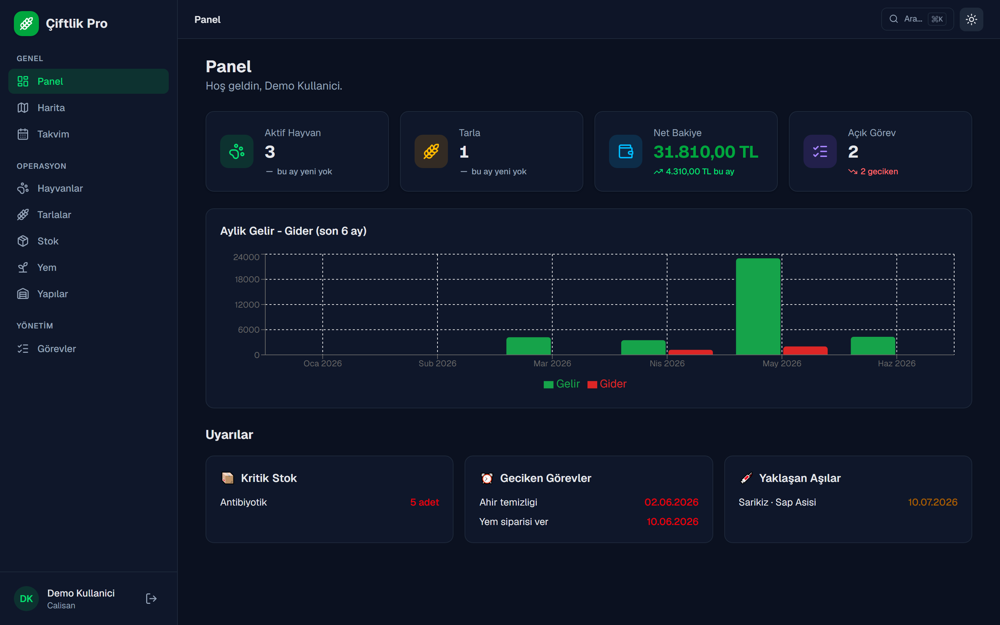
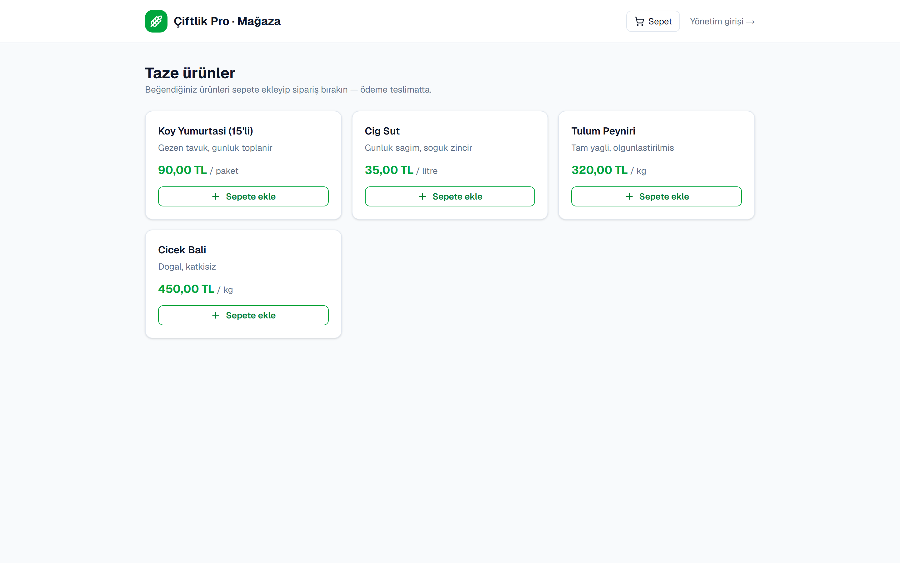
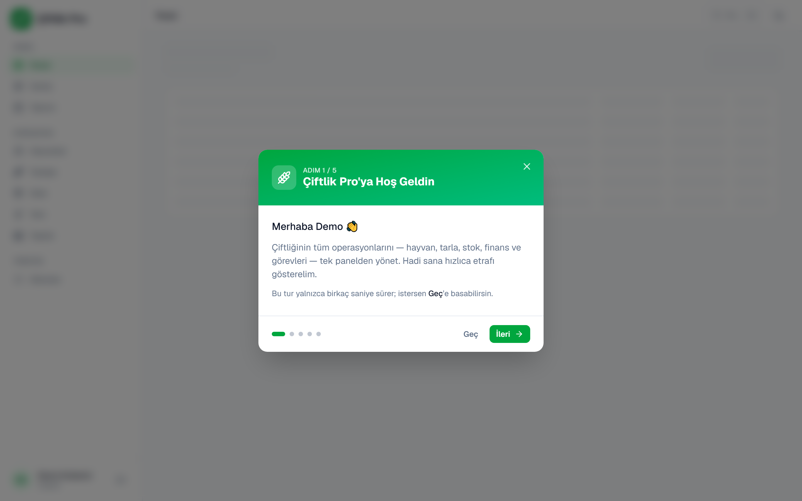
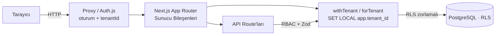

<div align="center">

# 🌾 Çiftlik Pro

**Her çiftlik sahibinin kendi izole çiftliğini (tenant) yönettiği, rol bazlı
yetkilendirmeye sahip, çok-kiracılı (multi-tenant) tam yığın Çiftlik Yönetim
Sistemi (ERP) — hayvan, tarla, stok, finans, satış, mağaza ve personel tek panelde.**

[](https://github.com/YusufKosarDev/ciftlik-pro/actions/workflows/ci.yml)
[](https://nextjs.org/)
[](https://www.typescriptlang.org/)
[](https://www.prisma.io/)
[](https://www.postgresql.org/)
[-success?logo=vitest&logoColor=white)](#test--kalite)
[](#test--kalite)
[](#-çok-kiracılık-multi-tenant-saas)
[](LICENSE)

🔗 **Canlı Demo: [ciftlik-pro.vercel.app](https://ciftlik-pro.vercel.app)**
&nbsp;·&nbsp; Giriş için **"Demo olarak gez"** butonu (veya `demo@ciftlik.com` / `demo1234`)

</div>

---

## 🌍 English Summary

**Çiftlik Pro** is a full-stack, **multi-tenant SaaS Farm Management System (ERP)**
where each farm owner signs up, gets an isolated tenant, and runs their entire
operation — animals, fields, inventory, finance, sales, a storefront, tasks and
staff — from a single role-based dashboard. _(The detailed documentation below is
in Turkish.)_

**Highlights**

- **Multi-tenancy with true isolation** — every tenant's data is isolated by
  **PostgreSQL Row-Level Security** (`ENABLE`/`FORCE`, `WITH CHECK`) *plus* an
  app-layer Prisma client extension that injects `tenantId` into every query. The
  tenant context is set per request via `SET LOCAL app.tenant_id` inside an
  interactive transaction (pgbouncer/serverless-safe). Cross-tenant leakage is
  covered by integration tests against a real non-superuser Postgres role.
- **Auth, RBAC & onboarding** — Auth.js (NextAuth v5) with four roles (Admin,
  Worker, Vet, Accountant), enforced centrally (`src/lib/authz.ts`) on both write
  APIs and sensitive pages. **Public farm sign-up** creates a tenant + owner-admin
  in one transaction; staff join via **tokenized invitations**. A read-only demo
  lets visitors explore without an account.
- **SaaS billing & plan limits** — FREE vs PRO plans with enforced limits (active
  animals / staff seats); env-gated **Stripe Subscription Checkout** with webhook
  → `Tenant.plan`, plus a usage dashboard. **KVKK/GDPR self-service:** full tenant
  data export (JSON) and account deletion.
- **Domain modules** — animal tracking (health, vaccinations, milk yield, weight,
  breeding & lineage), fields & crops with per-crop economics, inventory/feed with
  transactional stock deduction, finance, **sales & customers** (each sale auto-posts
  an income transaction), a **per-tenant public storefront** (`/magaza/[slug]`) with
  a cart and payment-free or **Stripe** checkout, calendar, tasks, a 2D farm map, and onboarding.
- **Security hardening** — HTTP security headers (CSP/HSTS/…), brute-force rate
  limiting on login/register, asynchronous scrypt hashing (with legacy bcrypt
  compatibility), http(s)-only image URLs, audited failed logins, and a full
  write audit log.
- **Performance** — server-side pagination/search/sort (DB `where`/`orderBy`/
  `skip`/`take` + `count`) with date-range indexes, database-level critical stock
  filtering, parallelized cron tenant processing, unstable_cache for storefronts,
  and lazy-loaded charts (`next/dynamic`).
- **Modern UI & i18n** — sidebar layout, dark mode (semantic color tokens), a ⌘K
  command palette, dashboard trend deltas, and a Turkish/English i18n foundation
  (next-intl).
- **Quality** — end-to-end type safety (Zod + Prisma), **265 unit/component tests**
  (Vitest + Testing Library), tenant-isolation integration tests (real Postgres,
  non-superuser role) and **7 e2e tests** (Playwright), run on every PR in CI
  against a real PostgreSQL service.

**Stack:** Next.js 16 (App Router, RSC) · TypeScript · PostgreSQL + Prisma 6
(**Row-Level Security** multi-tenancy) · Auth.js · Tailwind CSS · Zod · Stripe ·
next-intl · Recharts · Vitest + Playwright · Vercel.

🔗 **Live demo:** [ciftlik-pro.vercel.app](https://ciftlik-pro.vercel.app) — use the
**"Demo olarak gez"** (Browse as demo) button, or `demo@ciftlik.com` / `demo1234`.

---

## 📸 Ekran Görüntüleri

**Panel (Dashboard)** — sol sidebar, özet kartları (gerçek "bu ay" trend
göstergeleriyle) ve aylık gelir-gider grafiği:


| 🌙 Dark mode | 🛒 Herkese açık mağaza (`/magaza`) |
| ------------ | ---------------------------------- |
|  |  |

| Hayvanlar (sunucu-tarafı aranabilir tablo) | Hayvan detayı (süt/ağırlık grafikleri) |
| ------------------------------------------ | -------------------------------------- |
|  |  |

| 2D Çiftlik Haritası | Takvim (aşı/görev/hasat/doğum) |
| ------------------- | ------------------------------ |
|  |  |

**Hoş geldin turu (onboarding)** — ilk girişte role özel, çok adımlı tanıtım:



## ✨ Özellikler

- **Çok-kiracılık (multi-tenant SaaS)** — her çiftlik sahibi kayıt olup kendi
  **izole çiftliğini (tenant)** yönetir; veriler Postgres **RLS** + uygulama-katmanı
  `tenantId` filtreleriyle tenant'lar arasında **asla** sızmaz. Ayrıntı:
  [Çok-kiracılık](#-çok-kiracılık-multi-tenant-saas).
- **Kimlik doğrulama & RBAC** — giriş ve rol bazlı erişim (Admin, Çalışan,
  Veteriner, Muhasebeci). **Herkese açık çiftlik kaydı** (`/kayit`) tek
  transaction'da Tenant + sahip-ADMIN oluşturur; personel ise **token'lı davetle**
  tenant içinde eklenir. Parolalar asenkron scrypt ile hash'lenir (eski bcrypt şifreleriyle geriye dönük tam uyumludur).
- **Planlar & faturalandırma** — FREE/PRO planları ve zorlanan limitler (aktif
  hayvan / personel koltuğu); env-gated **Stripe abonelik** akışı (webhook →
  `Tenant.plan`) ve kullanım panosu. **KVKK:** veri ihracı (JSON) + çiftlik silme.
- **Hayvan takibi** — kayıt yönetimi, sağlık kayıtları, aşı takvimi (tarih
  uyarılı), süt verimi (trend grafiği), ağırlık/büyüme takibi (grafik).
- **Üreme & soy** — gebelik/doğum kayıtları ve yavru–anne (pedigri) bağlantısı.
- **Tarla yönetimi** — tarlalar, ekim/hasat kayıtları, ekim başına maliyet/gelir
  ve dönüm başına verim; 2D çiftlik haritası.
- **Stok & yem** — yem/ilaç/ekipman takibi, kritik seviye uyarısı; yem tüketimi
  stoğu otomatik düşürür (transactional).
- **Finans** — gelir-gider kayıtları, net bakiye özeti, aylık grafik.
- **Satış & Müşteri** — satış kayıtları müşteriye bağlanır; her satış otomatik bir
  **gelir işlemi** üretip finansa yansır (transactional). Müşteri detayında satış
  geçmişi ve toplam ciro.
- **Mağaza & Sipariş** — **per-tenant** herkese açık katalog (`/magaza` dizini →
  `/magaza/[slug]` çiftlik kataloğu), slug'a özel `localStorage` sepeti ve
  çok-kalemli sipariş; **Stripe** yapılandırıldıysa ödeme, yoksa "ödeme teslimatta".
  Admin tarafında ürün CRUD + sipariş durum yönetimi.
- **Takvim** — aşı, görev, hasat ve doğumlar tek aylık takvimde.
- **Personel & görevler** — çalışanlara görev atama, gecikme uyarısı.
- **Dashboard** — özet kartları (gerçek "bu ay" trend göstergeleriyle), kritik
  stok / geciken görev / yaklaşan aşı uyarıları.
- **Modern arayüz** — sol sidebar düzeni, dark mode (semantik renk token'ları), `⌘K`
  komut paleti (hızlı gezinme + eylem) ve `cva` tabanlı tasarım sistemi.
- **Çok dillilik (i18n)** — next-intl altyapısı (cookie-locale, varsayılan TR);
  giriş ekranı ve panel kabuğu TR/EN.
- **Hoş geldin turu (onboarding)** — ilk panel girişinde role özel, çok adımlı
  tanıtım modal'ı; Profil'den istenildiğinde yeniden başlatılabilir.
- **Aranabilir tablolar** — tüm liste modüllerinde **sunucu-tarafı (DB)** arama,
  kolon sıralama ve sayfalama; durum URL'de tutulur (paylaşılabilir/derin bağlantı).
- **E-posta bildirimleri** — günlük cron (Vercel Cron) ile kritik stok, geciken
  görev ve yaklaşan aşı özetini yöneticilere e-posta gönderir (Resend).

## 🏆 Öne Çıkan Mühendislik Detayları

- **Çok-kiracılı izolasyon (RLS + app)** — Postgres Row-Level Security (`FORCE` +
  `WITH CHECK`) ve tenant-kapsamlı Prisma extension; pgbouncer-uyumlu
  `SET LOCAL app.tenant_id`. Üretimde non-superuser rol. (Bkz.
  [Çok-kiracılık](#-çok-kiracılık-multi-tenant-saas).)
- **Rol bazlı yetkilendirme (RBAC)** tek merkezden (`src/lib/authz.ts`); hem yazma
  (API) hem hassas okuma (sayfa) düzeyinde uygulanır.
- **Uçtan uca tip güvenliği** — Zod şemaları hem istemci hem sunucuda doğrular;
  Prisma ile veritabanı tipleri.
- **Test & CI/CD** — 265 birim/bileşen testi (Vitest + Testing Library) +
  tenant-izolasyon entegrasyon testleri + 7 uçtan uca test (Playwright),
  GitHub Actions'ta gerçek PostgreSQL servisiyle her PR'da çalışır.
- **Transactional bütünlük** — yem tüketimi stoğu atomik düşürür (TOCTOU'ya karşı
  koşullu `updateMany`); satış + bağlı gelir işlemi ve sepet → çok-kalemli sipariş
  tek `$transaction` içinde, fiyat/ad **snapshot**'larıyla oluşturulur.
- **Serverless-doğru veritabanı** — pooled (`DATABASE_URL`) + direct
  (`DIRECT_URL`) ayrımıyla Vercel + Neon/Supabase'e hazır.
- **Sunucu-tarafı listeleme** — arama/sıralama/sayfalama veritabanında yapılır
  (`where` / `orderBy` / `skip` / `take` + `count`); büyük tablolarda bellek/ağ
  yükü sabit kalır. Sık filtrelenen tarih kolonlarında DB index'leri.
- **Performans-odaklı yükleme** — Recharts `next/dynamic` (ssr:false) ile tembel
  yüklenir; görseller lazy. Finans özet/kırılımı `groupBy` ile DB'de hesaplanır.
- **Opsiyonel/env-gated entegrasyonlar** — Stripe ödeme ve Resend e-posta yalnızca
  ilgili anahtarlar tanımlıysa devreye girer; yoksa uygulama sorunsuz çalışır.
- **Yeniden kullanılabilir tasarım sistemi** — `cva` tabanlı Button/Badge
  primitive'leri, URL-güdümlü jenerik `DataTable` ve semantik token tabanlı dark mode.

## 🧱 Mimari



- **App Router (RSC)** — listeler sunucuda **tenant-kapsamlı** Prisma ile okunur.
- **API Route'ları** — tüm yazma işlemleri; `authorizeWrite` (RBAC) + Zod doğrulaması.
- **Auth.js (NextAuth v5)** — JWT oturum (rol + **`tenantId`**); edge-uyumlu proxy ile rota koruması.
- **Tenant-kapsamlı Prisma** — `forTenant` her sorguya `tenantId` enjekte eder;
  `withTenant` interaktif transaction içinde `SET LOCAL app.tenant_id` ayarlar
  (pgbouncer-uyumlu). Postgres **RLS** DB-seviyesinde son garanti.

## 🔐 Güvenlik & RBAC

Yetkilendirme tek merkezden yönetilir (`src/lib/authz.ts`) ve **iki katmanda**
uygulanır: yazma uçları `authorizeWrite` ile, hassas/forma dayalı sayfalar ise
`requirePageWrite` / `requirePageView` ile korunur. **Okuma** giriş yapmış her
kullanıcıya açıktır; **yazma** ise role göre kısıtlanır:

| Rol           | Yazma yetkisi                                                        |
| ------------- | ------------------------------------------------------------------- |
| **Admin**     | Tüm modüller + personel yönetimi + denetim günlüğü                  |
| **Çalışan**   | Hayvan, süt, ağırlık, tarla/ekim, stok/yem, yapılar, üreme         |
| **Veteriner** | Sağlık & aşı, üreme, ağırlık                                        |
| **Muhasebeci**| Finans, Satış, Müşteri, Ürün/Mağaza, Sipariş yönetimi               |

Sertleştirme önlemleri:

- **Tenant izolasyonu (iki katman)** — Postgres **RLS** (`ENABLE`+`FORCE`,
  `WITH CHECK`) her tenant-tablosunu DB-seviyesinde korur; ayrıca uygulama katmanı
  her sorguya `tenantId` enjekte eder. Üretimde uygulama **non-superuser** rolle
  bağlanır (RLS bypass edilemez). İzolasyon entegrasyon testleriyle doğrulanır.
- **Kayıt & davet** — herkese açık **çiftlik kaydı** sahip-ADMIN üretir; personel
  yalnızca **token'lı davetle** eklenir. Davet token'ları tahmin edilemez sırlardır,
  süre sınırlıdır ve tek kullanımlıktır. Ziyaretçiler salt-okunur **"Demo olarak gez"** ile gezer.
- **Demo hesabı salt-okunurdur** — hiçbir yazma işlemi yapamaz (canlı demoda veri korunur).
- **Parolalar scrypt** ile hash'lenir (eski bcrypt şifreleriyle geriye dönük uyumludur);
  sabit zamanlı karşılaştırma (`timingSafeEqual`) ve asenkron hashing ile olay döngüsü kilitlenme korumalıdır. Düz metin asla saklanmaz/dönülmez.
- **HTTP güvenlik başlıkları** — tüm yanıtlara CSP, HSTS, `X-Frame-Options`,
  `X-Content-Type-Options`, `Referrer-Policy` ve `Permissions-Policy` (`next.config.ts`).
- **Brute-force koruması** — giriş ve kayıt uçlarında IP / e-posta bazlı hız sınırı
  (`src/lib/rate-limit.ts`); başarısız giriş denemeleri denetim günlüğüne
  (`LOGIN_FAILED`) yazılır. *Not: Bellek içi (in-memory Map) çalıştığından serverless
  (Vercel) dağıtımlarda kararsızlık gösterir; dağıtık üretim ortamlarında Upstash Redis
  veya veritabanı tabanlı bir rate-limiter'a geçilmesi önerilir.*
- **Güvenli görsel URL'leri** — hayvan görseli yalnızca `http(s)` URL kabul eder
  (Zod); `javascript:` / `data:` şemaları reddedilir (CSP `img-src` ile uyumlu).
- **Çift taraflı doğrulama** — Zod şemaları hem istemcide hem her yazma ucunda sunucuda çalışır.
- **Denetim günlüğü** — her yazma işlemi (kim / ne / ne zaman) `AuditLog`'a kaydedilir.
- **Korumalı cron** — bildirim ucu `CRON_SECRET` ile `Authorization` başlığı doğrular.

## 🏢 Çok-kiracılık (Multi-tenant SaaS)

Proje tek-çiftlik bir ERP'den, **her çiftlik sahibinin kendi izole çiftliğini
(tenant) yönettiği** çok-kiracılı bir SaaS'a dönüştürülmüştür. **#1 risk veri
sızıntısıdır:** tek bir tenant'sız sorgu = ihlal. Bu yüzden izolasyon **iki
bağımsız katmanda** zorlanır:

1. **Postgres Row-Level Security (RLS)** — her tenant-tablosunda `ENABLE` + `FORCE`
   ve `tenant_isolation` policy'si (`tenantId = current_setting('app.tenant_id')`,
   yazmada `WITH CHECK`). Sorgu nereyi unutursa unutsun **veritabanı sızdırmaz**.
   Üretimde uygulama **non-superuser** rolle bağlanır (`prisma/rls-app-role.sql`,
   bkz. [`docs/PRODUCTION-RLS.md`](docs/PRODUCTION-RLS.md)).
2. **Uygulama katmanı** — bir Prisma Client Extension (`forTenant`) `where`'lere
   otomatik `tenantId` enjekte eder; `withTenant` interaktif `$transaction` içinde
   `SET LOCAL app.tenant_id` ayarlar — **pgbouncer/serverless uyumlu** desen.

Öne çıkanlar:

- **Per-tenant unique kısıtlar** — örn. kulak numarası `@@unique([tenantId, tagNumber])`.
- **Oturum** — JWT/session'da `tenantId`; tüm okuma/yazma bu bağlamda çalışır.
- **Kayıt & davet** — public çiftlik kaydı (`/kayit`) + token'lı personel daveti (`/davet/[token]`).
- **Planlar** — FREE/PRO, zorlanan limitler, env-gated Stripe abonelik + kullanım panosu.
- **Per-tenant mağaza** — `/magaza/[slug]`; sipariş slug→tenant çözümüyle oluşturulur.
- **Cron çok-kiracılı** — günlük uyarılar her tenant'ın kendi verisiyle, kendi admin'lerine.
- **KVKK self-servis** — tenant verisi JSON ihracı + çiftlik silme (ADMIN).
- **İzolasyon testleri** — gerçek DB + non-superuser rolle: tenant A, tenant B'nin verisini göremez.

> Tam mimari ve fazlı durum: **[`docs/SAAS-PLAN.md`](docs/SAAS-PLAN.md)**.

## 🛠️ Teknolojiler

- [Next.js 16](https://nextjs.org/) (App Router) + TypeScript
- [PostgreSQL](https://www.postgresql.org/) + [Prisma 6](https://www.prisma.io/) (ORM)
- [Auth.js (NextAuth v5)](https://authjs.dev/) — kimlik doğrulama
- [Tailwind CSS](https://tailwindcss.com/) — arayüz
- [Zod](https://zod.dev/) — veri doğrulama
- [Stripe](https://stripe.com/) — ödeme (opsiyonel, env-gated)
- [next-intl](https://next-intl.dev/) — çok dillilik · [next-themes](https://github.com/pacocoursey/next-themes) — dark mode
- [Recharts](https://recharts.org/) — grafikler
- [Vitest](https://vitest.dev/) + [Playwright](https://playwright.dev/) — test
- [Docker](https://www.docker.com/) — yerel veritabanı

## Kurulum

### Gereksinimler

- Node.js 20+
- Docker (PostgreSQL için)

### Adımlar

1. Bağımlılıkları yükleyin:

   ```bash
   npm install
   ```

2. Ortam değişkenlerini ayarlayın — `.env.example` dosyasını `.env` olarak
   kopyalayıp değerleri doldurun:

   ```bash
   cp .env.example .env
   ```

   `AUTH_SECRET` üretmek için:

   ```bash
   node -e "console.log(require('crypto').randomBytes(32).toString('base64'))"
   ```

3. PostgreSQL veritabanını Docker ile başlatın:

   ```bash
   docker compose up -d
   ```

4. Veritabanı şemasını uygulayın:

   ```bash
   npx prisma migrate dev
   ```

5. (İsteğe bağlı) Örnek verilerle doldurun:

   ```bash
   npm run db:seed
   ```

6. Geliştirme sunucusunu başlatın:

   ```bash
   npm run dev
   ```

   Uygulama [http://localhost:3000](http://localhost:3000) adresinde çalışır.

### Örnek giriş bilgileri

Seed çalıştırıldıysa:

| E-posta             | Parola     | Rol       |
| ------------------- | ---------- | --------- |
| admin@ciftlik.com   | sifre1234  | Admin     |
| ahmet@ciftlik.com   | sifre1234  | Çalışan   |
| vet@ciftlik.com     | sifre1234  | Veteriner |

## Komutlar

| Komut              | Açıklama                          |
| ------------------ | --------------------------------- |
| `npm run dev`      | Geliştirme sunucusu               |
| `npm run build`    | Üretim derlemesi                  |
| `npm run start`    | Üretim sunucusu                   |
| `npm run lint`     | Kod denetimi (ESLint)             |
| `npm test`         | Birim testleri (Vitest)           |
| `npm run test:e2e` | Uçtan uca testler (Playwright)    |
| `npm run db:seed`  | Veritabanını örnek veriyle doldur |
| `npm run db:seed-demo` | Demo verisi + salt-okunur demo hesabı (idempotent) |

## Test & Kalite

- **Birim testleri (Vitest):** doğrulama şemaları, RBAC yetkilendirme, hız sınırı,
  liste sorgu parametreleri, plan limitleri, finans/harita/tarih/takvim yardımcıları
  + UI bileşenleri (Testing Library: Badge/Button/EmptyState/DataTable/OnboardingModal)
  — `npm test` (265 test). Kapsam raporu için
  `npm run test:coverage` (iş mantığı `src/lib` için ~%95 satır kapsamı).
- **Tenant-izolasyon entegrasyon testleri:** gerçek PostgreSQL + non-superuser rolle
  `forTenant`/RLS izolasyonu (`*.int.test.ts`); tenant A, tenant B'nin verisine erişemez.
- **Uçtan uca testler (Playwright):** kimlik doğrulama, hayvan CRUD akışı ve
  RBAC erişim engeli — `npm run test:e2e` (7 test).
- **CI (GitHub Actions):** her push/PR'da iki paralel job —
  `build` (tsc + ESLint + Vitest + üretim derlemesi) ve
  `e2e` (gerçek PostgreSQL servisi + seed + Playwright).
- **Pre-commit (husky + lint-staged):** commit öncesi staged `.ts/.tsx`
  dosyalarında otomatik `eslint --fix` çalışır.

## Proje Yapısı

```
prisma/            Şema ve migration dosyaları
src/
  app/             Sayfalar ve API rotaları (App Router)
    api/           REST API uç noktaları
    panel/         Korumalı yönetim paneli
  components/      Yeniden kullanılabilir bileşenler
  lib/             Yardımcılar (prisma, auth, doğrulama, etiketler)
```

## Vercel'e Deploy

1. **Veritabanı:** [Neon](https://neon.tech) veya [Supabase](https://supabase.com)
   üzerinde bir PostgreSQL oluşturun. İki bağlantı dizesi alın:
   - **Pooled** (pgbouncer) → `DATABASE_URL` (uygulama çalışma zamanı)
   - **Direct** (pooler olmayan) → `DIRECT_URL` (migration'lar için)

   > Serverless ortamda (Vercel) bağlantı tükenmesini önlemek için uygulama
   > havuzlanmış bağlantı, migration'lar ise doğrudan bağlantı kullanır.

2. **Vercel:** Bu repoyu Vercel'e import edin (Next.js otomatik algılanır).
   `prisma generate` deploy sırasında `postinstall` ile otomatik çalışır.
3. **Ortam değişkenleri** (Vercel → Project Settings → Environment Variables):

   | Değişken         | Açıklama                                       |
   | ---------------- | ---------------------------------------------- |
   | `DATABASE_URL`   | Üretim PostgreSQL **pooled** bağlantı dizesi   |
   | `DIRECT_URL`     | Üretim PostgreSQL **direct** bağlantı dizesi   |
   | `AUTH_SECRET`    | `openssl rand -base64 32` ile üretin           |
   | `ADMIN_EMAIL`    | İlk yönetici e-postası                         |
   | `ADMIN_PASSWORD` | İlk yönetici parolası (en az 8 karakter)       |
   | `ADMIN_NAME`     | İlk yönetici adı (opsiyonel)                   |

   > **Opsiyonel (env-gated):** `STRIPE_SECRET_KEY` + `STRIPE_WEBHOOK_SECRET`
   > (mağaza ödemesi), `STRIPE_PRO_PRICE_ID` (PRO abonelik faturalandırması),
   > `RESEND_API_KEY` + `ALERT_EMAIL_FROM` (e-posta uyarıları), `CRON_SECRET`
   > (cron koruması), `NEXT_PUBLIC_SITE_URL` (Stripe redirect adresi). Tanımlı
   > değilse ilgili özellik zarif biçimde devre dışı kalır. Tümü `.env.example`'da listelidir.

4. **Şemayı üretim DB'sine uygulayın** (ilk deploy'dan önce, yerelden):

   ```bash
   # Migration'lar direct bağlantı üzerinden uygulanır
   DATABASE_URL="<pooled>" DIRECT_URL="<direct>" npm run db:deploy
   DATABASE_URL="<pooled>" DIRECT_URL="<direct>" \
     ADMIN_EMAIL=... ADMIN_PASSWORD=... npm run db:seed-admin
   ```

   Alternatif: Vercel **Build Command**'i `prisma migrate deploy && next build`
   yaparak migration'ı her deploy'da otomatik uygulayabilirsiniz.

5. `main` dalına push → Vercel otomatik derleyip yayınlar.
