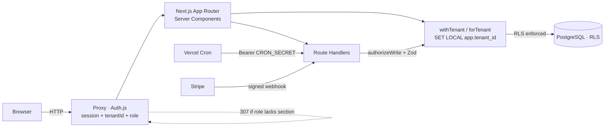

# Architecture & Design Decisions

This document explains **why** Çiftlik Pro is built the way it is. It is organised
around the decisions that were genuinely hard, the alternatives that were rejected,
and the trade-offs that came with each choice.

For the phased migration plan see [`SAAS-PLAN.md`](SAAS-PLAN.md) (Turkish); for the
production database role setup see [`PRODUCTION-RLS.md`](PRODUCTION-RLS.md) (Turkish).

---

## The shape of the system



- **Reads** happen in Server Components through a tenant-scoped Prisma client.
- **Writes** all go through Route Handlers: RBAC first, Zod second, tenant
  transaction third.
- **The database is the last line of defence**, not the first.

---

## Decision 1 — Row-level multi-tenancy, enforced twice

### The problem

The single biggest risk in a multi-tenant SaaS is a cross-tenant data leak. One
forgotten `where: { tenantId }` in one query is a breach. Code review does not
scale as a defence: there are ~47 write endpoints and dozens of read paths, and
every new feature is another chance to forget.

### Options considered

| Option | Why not |
| --- | --- |
| **Database per tenant** | Operationally heavy for a project this size: migrations must fan out across N databases, connection pools multiply, and serverless connection limits become the bottleneck almost immediately. |
| **Schema per tenant** | Same migration fan-out problem, plus Prisma has no first-class multi-schema story for this pattern. |
| **Row-level (`tenantId` column), app-layer filtering only** | One missed filter equals a breach, and nothing structurally prevents it. |
| **Row-level + PostgreSQL RLS** ✅ | Shared schema (simple migrations, one pool) with a guarantee that does not depend on remembering. |

### What was built

Two **independent** layers:

1. **PostgreSQL Row-Level Security.** Every tenant-scoped table has
   `ENABLE` + `FORCE ROW LEVEL SECURITY` and a `tenant_isolation` policy:
   `tenantId = current_setting('app.tenant_id')`, with `WITH CHECK` on writes so a
   row cannot be written into the wrong tenant either. If a query forgets its
   filter, the database returns nothing rather than someone else's data.

   Two reads legitimately happen *before* a tenant context exists: signing in
   (the user is found by email) and opening an invitation link (the invite is
   found by token). Both are `SECURITY DEFINER` functions — `auth_user_by_email`
   and `invitation_by_token` — each filtering on a single equality and returning
   the minimum. That keeps the tables themselves under RLS with **no exceptions**;
   the token function does not even return the token.

2. **A Prisma Client Extension** (`forTenant`, [`src/lib/tenant-prisma.ts`](../src/lib/tenant-prisma.ts))
   that injects `tenantId` into the `where` of every list/count/aggregate/
   `updateMany`/`deleteMany` operation. This layer exists for **ergonomics**, not
   safety — it means day-to-day code reads naturally.

`FORCE` matters: without it, the table owner bypasses its own policies. And the
application connects as a dedicated `NOSUPERUSER NOBYPASSRLS` role
(`prisma/rls-app-role.sql`), because a superuser ignores RLS entirely — which
would silently reduce the whole design to layer 2 only.

### Why `create` is not auto-injected

The extension deliberately does **not** inject `tenantId` on `create`. Callers pass
it explicitly, the type system requires it (`tenantId` is `NOT NULL` on 20 tables),
and RLS `WITH CHECK` rejects a wrong value. One explicit mechanism beats two
partially-overlapping implicit ones.

### The known gap, and why it is covered

Unique-targeted operations (`findUnique`, `update`, `delete`, `upsert`) address a
single row by primary key — there is no `where` to extend. The application layer
**cannot** protect these. This is exactly why RLS is not optional: at the database
level those operations return zero rows outside the tenant context. The isolation
tests assert precisely this, including `findUnique` by a known foreign id.

### Verification

[`src/lib/tenant-rls.int.test.ts`](../src/lib/tenant-rls.int.test.ts) runs against a
real PostgreSQL instance **as the non-superuser role** and asserts:

- tenant A cannot see tenant B's rows via `findMany` **or** `findUnique`;
- with no `app.tenant_id` set, **zero** rows are visible — the system fails closed;
- `Invitation` is covered too: a known token returns nothing through a direct
  query, while `invitation_by_token` still serves the public accept flow.

These run in CI on every push and pull request (the `integration` job creates the
`ciftlik_app` role and points the tests at it), not only on a developer's machine.

---

## Decision 2 — `SET LOCAL` inside an interactive transaction

### The problem

RLS reads the tenant from `current_setting('app.tenant_id')`. The obvious way to
set it is a session-level `SET`. That is wrong for this deployment.

In serverless (Vercel + Neon/Supabase) the application talks to a **connection
pooler** (pgbouncer in transaction mode). Connections are handed out per
transaction and reused across tenants. A session-level variable would leak from one
request to the next — the exact bug the whole design exists to prevent, but worse,
because it would be intermittent.

### What was built

`withTenant` opens an **interactive transaction** and sets the variable
transaction-locally:

```ts
forTenant(tenantId).$transaction(async (tx) => {
  await tx.$executeRaw`SELECT set_config('app.tenant_id', ${tenantId}, true)`;
  //                   set_config(..., is_local = true) === SET LOCAL
  return fn(tx);
});
```

`SET LOCAL` is scoped to the transaction, so the pooler can safely hand the
connection to another tenant afterwards. The trade-off is that **every** tenant
operation is a transaction — slightly more overhead per request in exchange for an
isolation guarantee that survives connection reuse.

The pooled/direct split (`DATABASE_URL` / `DIRECT_URL`) follows from the same
reality: migrations need a direct connection because poolers in transaction mode
cannot run DDL sessions.

---

## Decision 3 — Login has to bypass RLS, deliberately

### The problem

Authentication is the one moment when the tenant is **unknown**: the user types an
email, and only after that lookup do we learn which tenant they belong to. But
`User` is a tenant-scoped table with `FORCE` RLS. As the non-superuser application
role and with no `app.tenant_id` set, `prisma.user.findUnique({ where: { email } })`
correctly returns **zero rows** — so nobody could ever log in.

This is the system working as designed, colliding with a genuine requirement.

### Options considered

| Option | Why not |
| --- | --- |
| Take `User` out of RLS | Throws away protection on the most sensitive table to solve a one-query problem. |
| Have the client send the tenant slug on login | Leaks tenant existence, adds friction, and is trivially enumerable. |
| Connect as superuser for login | Reintroduces the exact bypass the design forbids. |
| **A `SECURITY DEFINER` function** ✅ | Narrow, auditable, single-purpose escape hatch. |

### What was built

Migration `20260618167000_auth_lookup_function` defines `auth_user_by_email(text)`
as `SECURITY DEFINER`: it runs with the definer's privileges, so it can read across
tenants — but it does exactly one thing, takes one argument, and returns one row
(email is globally unique). Everything else stays under RLS.

```ts
const rows = await prisma.$queryRaw`SELECT * FROM auth_user_by_email(${email})`;
```

The trade-off is explicit: one audited, single-purpose bypass instead of weakening
the policy for every query touching `User`.

---

## Decision 4 — Authorization in one place, checked in three

`src/lib/authz.ts` holds the entire permission matrix. It is applied at three
levels, each catching what the previous one cannot:

| Level | Mechanism | Catches |
| --- | --- | --- |
| **Edge (proxy)** | `authorized()` in `auth.config.ts` | Unauthenticated access and role-forbidden `/panel` sections — returns a real `307` before any rendering. |
| **Page (RSC)** | `requirePageView` / `requirePageWrite` | Direct navigation to a sensitive page or form. |
| **API** | `authorizeWrite(module)` | Every write, including anything a client could call directly. |

Reads are open to any signed-in user; writes are role-restricted. The demo account
is blocked from **all** writes by email, independent of its role — which is why it
can safely be an ADMIN and still show off the billing and staff screens.

---

## Decision 5 — Correctness under concurrency

Two flows can corrupt data if written naively.

**Feed consumption** (`/api/feed`) must never drive stock negative. Read-then-write
has a TOCTOU window: two concurrent requests both read `quantity = 10`, both accept
a deduction of 8. The fix is to make the check part of the write:

```ts
const updated = await db.inventoryItem.updateMany({
  where: { id, quantity: { gte: requested } },   // the guard IS the query
  data:  { quantity: { decrement: requested } },
});
if (updated.count === 0) throw new InsufficientStockError();
```

**Sales and orders** must be all-or-nothing. A sale writes both the sale row and its
linked `INCOME` transaction inside a single transaction, so the books can never
disagree with the sales list. A storefront order writes the order and its lines
together, snapshotting product name and unit price per line — a later price change
must not rewrite history.

**Rate limiting** has the same shape of problem. An in-memory counter is correct on
one instance and progressively wrong as instances multiply: on serverless, three
instances mean three separate counters and three times the effective limit. The
counter therefore lives in Postgres, and the increment is a single statement:

```sql
INSERT INTO "RateLimit" (key, count, "resetAt") VALUES ($key, 1, $resetAt)
ON CONFLICT (key) DO UPDATE SET
  count   = CASE WHEN "RateLimit"."resetAt" <= now() THEN 1 ELSE "RateLimit".count + 1 END,
  "resetAt" = CASE WHEN "RateLimit"."resetAt" <= now() THEN $resetAt ELSE "RateLimit"."resetAt" END
RETURNING count, "resetAt";
```

Read-then-write would let concurrent requests read the same value and undercount;
the upsert cannot. An integration test fires ten simultaneous requests against a
limit of four and asserts that exactly four succeed and the stored count is ten.

**Redis was considered and rejected** for this project: it would add a service, a
secret and a failure mode to solve a problem the existing database already solves
at this scale. If write volume ever made the counter table hot, moving to Redis is
a contained change — the module's interface does not name its storage.

If the database is unreachable the limiter **fails open** onto the in-memory
counter rather than locking everyone out. Rate limiting is a depth layer, not the
gate: refusing all logins during a database blip would cause more harm than the
abuse it prevents.

---

## Decision 6 — Optional integrations degrade, never break

Stripe, Resend and the cron endpoints are **env-gated**. Without keys the app runs
completely: the storefront falls back to pay-on-delivery, email alerts are skipped,
and the cron endpoints return `503` rather than running unprotected. This keeps a
one-command local setup honest — a reviewer clones the repo and everything works
without signing up for anything.

The same principle drives the demo dataset: it is versioned in
[`src/lib/demo-data.ts`](../src/lib/demo-data.ts) and re-seeded automatically when
the version changes, so the live demo repairs itself instead of depending on someone
remembering to run a script.

---

## Decision 7 — Observability without a new vendor (for now)

Three surfaces answer "what happened in production", and none of them requires an
extra service:

| Surface | Answers |
| --- | --- |
| **Vercel runtime logs & error grouping** | Unhandled exceptions, per-route error rates, cold starts. Available on the platform the app already deploys to. |
| **`AuditLog` table** | Who changed what and when — including `LOGIN_FAILED` with the source IP. This is a product feature, not just telemetry: admins read it in `/panel/denetim`. |
| **Structured server logging** | Every catch block logs a named error before returning a 5xx, so a log search by message lands on the code path. |

Error-tracking SaaS (Sentry and friends) was **deliberately not added**. It would
introduce a dependency, a DSN to manage, and a second place to look — to improve on
what the platform already reports, at a scale this project does not have. The
honest trigger for revisiting is real users: once errors need assignment, release
tracking and alerting, platform logs stop being enough.

Two smaller choices follow the same "fail visibly, not loudly" principle:

- Missing configuration returns **`503`**, not `500` — a cron without `CRON_SECRET`
  or a webhook without Stripe keys is not a crash, and should not inflate the
  5xx rate that alerting watches.
- Best-effort writes (audit logging) **never** throw into the request path; they
  log and continue. An audit failure must not roll back the user's actual work.

---

## Known limitations

Stated plainly, because pretending they do not exist is worse than having them.

| Limitation | Impact | Path forward |
| --- | --- | --- |
| **One tenant per user** | `User.tenantId` is a single value; a person cannot belong to two farms. | Introduce a `Membership` join table; the session already carries `tenantId`, so the change is mostly in auth and the tenant resolver. |
| **Tenant resolved from the session, not the URL** | No `acme.ciftlik-pro.app` subdomains yet. | `Tenant.slug` already exists and the storefront already resolves by slug; extending it to the panel is additive. |
| **Invitation tokens stored in plaintext** | Database read access exposes pending invite tokens. | Store a hash and compare on accept — tokens are already single-use and time-limited. |
| **Two surfaces stay Turkish by design** | Farm data (animal names, product descriptions, task titles — including the demo dataset) and the daily digest email. | Neither is a translation gap: data belongs to the tenant who typed it, and the cron that sends the digest has no viewer whose language to read. Per-tenant language would be the way to localize the digest. |
